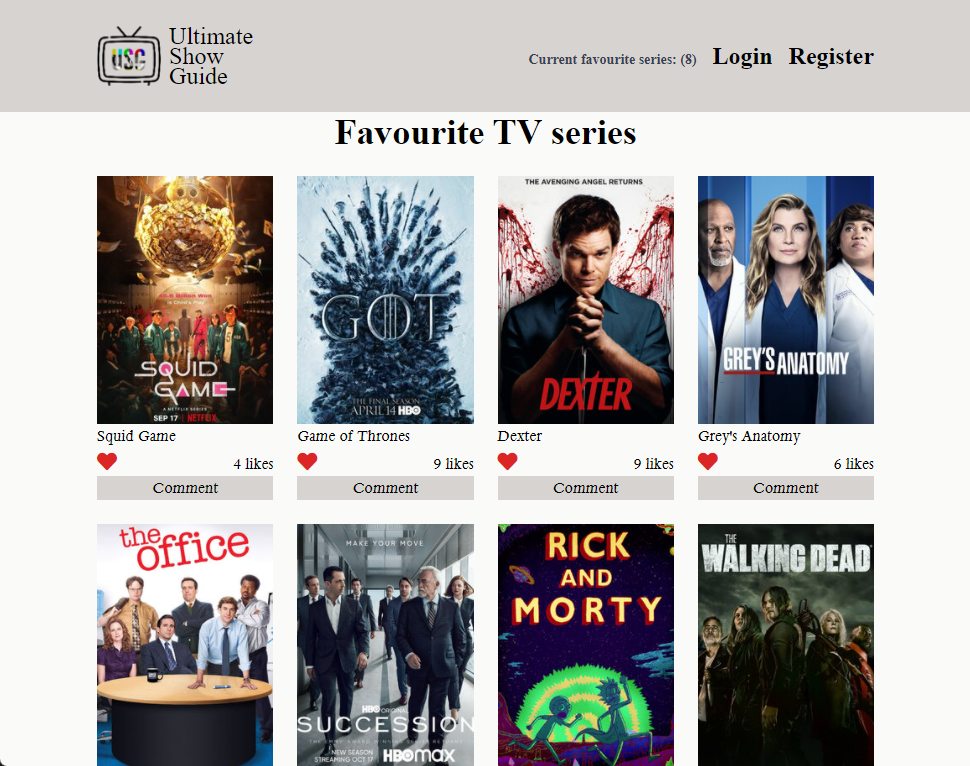
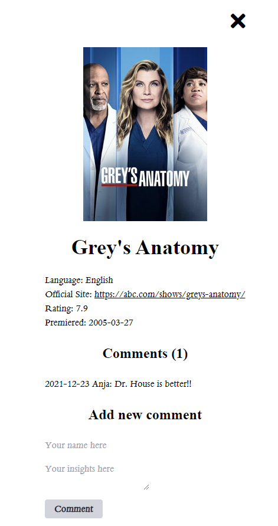

# Ultimate Show Guide

We want to introduce you this web page that will help you to manage all your favourite TV series from place.

<!-- Include a paragraph of the app -->

### 🖥️ Desktop version

#### Home Page

This page will show your favorite TV series

#### Comments PopUp

This window will show you the comments and extended information about the selected TV serie

<!-- Include some screenshots of desktop version -->

<!-- ### 📱 Mobile version -->

<!-- Include some screenshots of mobile version -->

## ✅ Learning objectives

- Use JavaScript to make websites dynamic and build basic single page apps.
- Send and receive data from an API.
- Use AAA pattern for unit tests.

## 🧩 Built With

- HTML
- TailwindCSS
- Javascript
- Linters
- Jest
- Webpack

## 📚 Getting Started

To get a local copy up and running follow these simple example steps.

### Prerequisites

For this project you don't need any aditional tools to run it

### Setup

Fork a copy to your repository and clone it locally

### Install

Run `npm install` from your terminal window

### Usage

You can work in your favorite Code Editor

## 💻📱 Live Preview

<!-- There is no Live Demo available at the moment -->

If you want to see a live demo of this project, [click here](https://williamrolando88.github.io/ultimate-show-guide/)

## Authors

👤 **Anja**

- GitHub: <a href="https://github.com/Anjacodes" rel="noopener noreferrer">@Anjacodes</a> 
- Twitter: <a href="https://twitter.com/Anja_Schmidt7" rel="noopener noreferrer">@Anja_Schmidt7</a> 
- LinkedIn: <a href="https://www.linkedin.com/in/anja-schmidt7/" rel="noopener noreferrer">Anja Schmidt</a> 

👤 **William Morales**

- GitHub: [@williamrolando88](https://github.com/williamrolando88)
- Twitter: [@WillyMorales93](https://twitter.com/WillyMorales93)
- LinkedIn: [William Morales](https://www.linkedin.com/in/william-rolando-morales/)

## 🤝 Contributing

Contributions, issues, and feature requests are welcome!

Feel free to check the [issues page](../../issues).

## 👏 Show your support

Give a ⭐️ if you like this project!

## 👍 Credits

API for fetching TV series information:

- [TV Maze](https://www.tvmaze.com/api)

## 📝 License

Copyright (c) 2021 Anja Schmidt, William Morales

Permission is hereby granted, free of charge, to any person obtaining a copy of this software and associated documentation files (the "Software"), to deal in the Software without restriction, including without limitation the rights to use, copy, modify, merge, publish, distribute, sublicense, and/or sell copies of the Software, and to permit persons to whom the Software is furnished to do so, subject to the following conditions:

The above copyright notice and this permission notice shall be included in all copies or substantial portions of the Software.

THE SOFTWARE IS PROVIDED "AS IS", WITHOUT WARRANTY OF ANY KIND, EXPRESS OR IMPLIED, INCLUDING BUT NOT LIMITED TO THE WARRANTIES OF MERCHANTABILITY, FITNESS FOR A PARTICULAR PURPOSE AND NONINFRINGEMENT. IN NO EVENT SHALL THE AUTHORS OR COPYRIGHT HOLDERS BE LIABLE FOR ANY CLAIM, DAMAGES OR OTHER LIABILITY, WHETHER IN AN ACTION OF CONTRACT, TORT OR OTHERWISE, ARISING FROM, OUT OF OR IN CONNECTION WITH THE SOFTWARE OR THE USE OR OTHER DEALINGS IN THE SOFTWARE.
